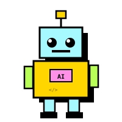
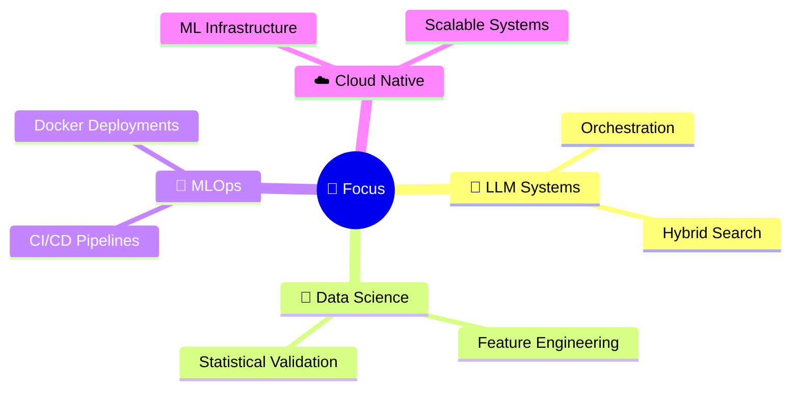

<!-- ═══════════════════════════════════════════════════════════════
     Hey recruiter 👀 — yes, I built this README from scratch too.
     ═══════════════════════════════════════════════════════════════ -->

<div align="center">

<!-- CUSTOM ANIMATED HEADER -->


<!-- TYPING ANIMATION — rotating one-liners -->
<a href="https://git.io/typing-svg"></a>

<br/>

<!-- CLEAN SOCIAL BADGES — matching palette -->
<a href="https://www.linkedin.com/in/adityasingh-julyai/"></a>&nbsp;
<a href="mailto:ddeaditya@gmail.com"></a>&nbsp;


</div>

<br/>

<!-- ─── ABOUT ─── -->



### `> aditya.init()` &nbsp; 🧑‍💻

```js
// aditya.config.js — last updated: 2026

const aditya = {
    name       : "Aditya Singh",
    role       : "AI / ML Engineer",
    superpower : "Notebooks → Production 🚀",
    motto      : "Build fast. Ship faster. Break nothing.",
    fun_fact   : "I mass-debug LLMs at 2 AM for fun 🤖",
    coffee     : Infinity,
    currently  : "training something that might be sentient 👀",
};

export default aditya;
```

<br clear="right"/>

<div align="center"></div>

<br/>

<!-- ─── WHAT I SHIP ─── -->
##  &nbsp;What I Ship

> *I don't build models. I build **systems** that ship models.*

<table>
<tr>
<td width="50%" valign="top">

**`🧠 AI & ML Core`**

| | |
|:--|:--|
| 🔮 | Large Language Models (LLMs) |
| 🔍 | Retrieval-Augmented Generation (RAG) |
| ⚙️ | End-to-End ML Pipelines |
| 📦 | MLOps & Model Deployment |

</td>
<td width="50%" valign="top">

**`🔧 Systems & Infra`**

| | |
|:--|:--|
| 🌐 | Backend-integrated AI Systems |
| 📊 | Scalable Data Processing |
| 🔄 | CI/CD for ML Workflows |
| ☁️ | Cloud-native ML Infrastructure |

</td>
</tr>
</table>

<div align="center">

```
  experiment  →  validate  →  containerize  →  deploy  →  monitor  →  iterate
     💡           ✅             🐳             🚀          📈          🔄
```

</div>

<br/>

<div align="center"></div>

<br/>

<!-- ─── TECH ARSENAL ─── -->
## 🛠️ &nbsp;Tech Arsenal

<div align="center">

**`Machine Learning & AI`**
<br/>


**`LLM & NLP`**
<br/>


**`Data & Feature Engineering`**
<br/>


**`Backend & Deployment`**
<br/>


**`Systems`**
<br/>


</div>

<br/>

<div align="center"></div>

<br/>

<!-- ─── CURRENT FOCUS ─── -->
## 🎯 &nbsp;Current Focus

<div align="center">



</div>

<br/>

<div align="center"></div>

<br/>

<!-- ─── FEATURED PROJECTS ─── -->
## 📌 &nbsp;Featured Projects

<table>
<tr>
<td width="33%" align="center">

**🔬 EDA & Feature Engineering**

<sub>Real-world EDA pipelines with statistical validation & feature transformation</sub>

<br/>

`✅ Done`

</td>
<td width="33%" align="center">

**🌐 Streamlit & Flask ML Deploy**

<sub>RESTful APIs & interactive ML apps for model inference</sub>

<br/>

`✅ Done`

</td>
<td width="33%" align="center">

**🏗️ End-to-End ML Systems**

<sub>Training → Evaluation → Experiment Tracking → Containerized Deployment</sub>

<br/>

`🔨 Building`

</td>
</tr>
</table>

<br/>

<div align="center"></div>

<br/>

<!-- ─── STATS ─── -->
## 📈 &nbsp;GitHub Stats

<div align="center">


&nbsp;&nbsp;


<br/><br/>


<br/><br/>


</div>

<br/>

<div align="center"></div>

<br/>

<!-- ─── ROADMAP ─── -->
## 🗺️ &nbsp;Engineering Roadmap

> Day-by-day public build toward production-grade AI engineering.

```
  ┌─────────────────────────────────────────────────────────────┐
  │                                                             │
  │   🤖  Production LLM Systems                               │
  │   📚  RAG-based Applications                               │
  │   ☁️   Scalable ML Infrastructure                           │
  │   🔬  Research → Production AI Engineering                  │
  │                                                             │
  │   status: in_progress ███████████░░░░░░░░░  55%             │
  │                                                             │
  └─────────────────────────────────────────────────────────────┘
```

<br/>

<div align="center"></div>

<br/>

<!-- ─── VIBE CHECK ─── -->
## ✨ &nbsp;Vibe Check

<div align="center">


&nbsp;

&nbsp;

&nbsp;


<br/><br/>


</div>

<br/>

<div align="center"></div>

<br/>

<!-- ─── CONNECT ─── -->
## 🤝 &nbsp;Let's Connect

<div align="center">

<a href="https://www.linkedin.com/in/adityasingh-julyai/"></a>
&nbsp;&nbsp;
<a href="mailto:ddeaditya@gmail.com"></a>

<br/><br/>

```
💬 Open to: collabs • ML consulting • building cool stuff • memes about gradient descent
```

</div>

<br/>

<!-- ─── FOOTER ─── -->
<div align="center">


<br/>

**`⚡ Engineering AI systems that scale beyond notebooks.`**

<br/>

<sub>

&nbsp;·&nbsp;

&nbsp;·&nbsp;

</sub>

<br/><br/>

<sub>if you read this far, you're either a recruiter or an LLM. either way — let's talk. 🤝</sub>

</div>
