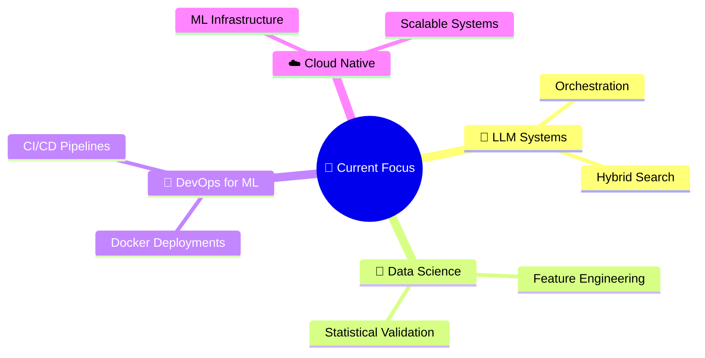

<div align="center">

<!-- ANIMATED HEADER -->


<!-- ONE-LINER TYPING ANIMATION -->
<a href="https://git.io/typing-svg"></a>

<br/>

<!-- SOCIAL / CONNECT BADGES -->
[](https://www.linkedin.com/in/adityasingh-julyai/)
[](mailto:ddeaditya@gmail.com)
[](https://github.com/aaadityasngh)

</div>

<!-- FUN INTRO -->


### `> whoami` 🧑‍💻

```yaml
name: Aditya Singh
role: AI / ML Engineer
superpower: Moving models from notebooks → production 🚀
vibe: Build fast. Ship faster. Break nothing. ☕
fun_fact: I talk to LLMs more than humans 🤖
```

<br clear="right"/>

---

<!-- WHAT I DO — FAST SCAN SECTION -->
## ⚡ What I Do

> I design and deploy **production-grade ML systems** — from data to deployment.

<table>
<tr>
<td width="50%" valign="top">

🧠 **AI & ML Engineering**
- Large Language Models (LLMs)
- Retrieval-Augmented Generation (RAG)
- End-to-End ML Pipelines
- MLOps & Model Deployment

</td>
<td width="50%" valign="top">

🔧 **Systems & Infrastructure**
- Backend-integrated AI Systems
- Scalable Data Processing
- CI/CD for ML Workflows
- Cloud-native ML Infrastructure

</td>
</tr>
</table>

```
experimentation → reproducible training → containerized deployment → API exposure 🎯
```

---

## 🛠️ Tech Arsenal

<div align="center">

#### 🤖 Machine Learning & AI


#### 🗣️ LLM & NLP


#### 📊 Data & Feature Engineering


#### ⚙️ Backend & Deployment


#### 🖥️ Systems


</div>

---

## 🧠 Current Focus

<div align="center">



</div>

---

## 📌 Featured Projects

| Project | What It Does | Status |
|:--------|:------------|:------:|
| 🔬 **EDA & Feature Engineering** | Real-world EDA pipelines with statistical validation & feature transformation | ✅ Done |
| 🌐 **Streamlit & Flask ML Deploy** | RESTful APIs & interactive ML apps for model inference | ✅ Done |
| 🏗️ **End-to-End ML Systems** | Training → Evaluation → Experiment Tracking → Containerized Deployment | 🔨 Building |

---

## 📈 GitHub Stats

<div align="center">


<br/>


<br/>

<!-- ACTIVITY GRAPH -->


</div>

---

## 🗺️ Engineering Roadmap

```
📍 Where I'm headed — day-by-day public build:

  ┌─────────────────────────────────────────────────────┐
  │  🤖 Production LLM Systems                         │
  │  📚 RAG-based Applications                         │
  │  ☁️  Scalable ML Infrastructure                     │
  │  🔬 Research-to-Production AI Engineering           │
  └─────────────────────────────────────────────────────┘
```

---

## 🤝 Let's Connect

<div align="center">

[](https://www.linkedin.com/in/adityasingh-julyai/)
[](mailto:ddeaditya@gmail.com)

<br/>


</div>

---

<div align="center">


**⚡ Engineering AI systems that scale beyond notebooks.**


</div>
